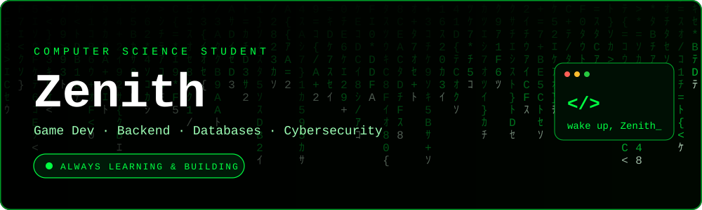

---

## 👋 About Me

I'm **Zenith**, a Computer Science student who likes turning ideas into working projects, especially games, websites, and the backend systems behind them. I'm looking for guidance on **game development** and **backend engineering**, and I'm building my foundation in **databases** and **cybersecurity** along the way.

- 🔭 Working on games, websites, and bits of random things
- 🌱 Currently learning databases
- 🤝 Looking for guidance on game development and backend
- 💬 Ask me about video games
- ⚡ Fun fact: I like the gym

---

## 🎯 What I'm Exploring

| Area | Current direction |
|------|-------------------|
| 🎮 Game development | Building small games and learning game design with Godot |
| 🖥️ Backend development | APIs, server setup, and how data flows through an application |
| 🗄️ Databases | Designing schemas and writing queries with MySQL and SQLite |
| 🔐 Cybersecurity | Learning security fundamentals and writing safer code |
| 🧩 Generalist development | Picking up new tools whenever a project needs them |

---

## 💻 Tech Stack

---

## 🌐 Socials

---

## 📊 GitHub Stats

  
  

---

## ☕ Support Me

